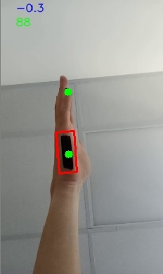

# Whats its all about
The purpose of the repository is to record:
- EMG data
- The corresponding labels

# Generate label from video stream
The labels are 2 time series for the following values:
- Degree of the Palm
- Distance of palm and pinky finger (AKA isFist)

Stream.py process a video or live stream from the following setup!:\

## Algoritm
The script finds the contour of biggest black object(AKA palm)
- Calculate the degree of the palm
- Apply 1D kalman filter to the degree
- Normalize it -1, 1 

The script finds the contour of biggest green object(AKA finger)
- Calculate the distance of the finger and palm

## Usage

python stream.py

# EMG Data
The project works with the Mindrove ArmBand device:\
[Mindrove Official Site](https://mindrove.com/product/armband_8_ch/)

The device uses the mindrove-brainflow package:
>pip install mindrove-brainflow

## Visualizer
The visualize.ipynb visualize the live feed from the device.

